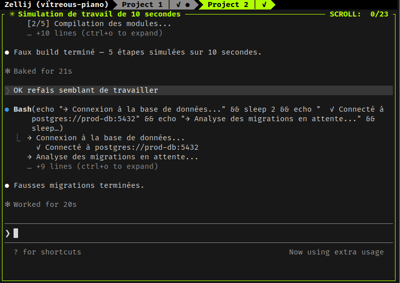

# cc-zellij-tab-status

Plugin [Claude Code](https://claude.ai/code) qui suffixe le nom de chaque tab Zellij avec l'état des Claude Code qui y tournent.

```
myproject ⏐ ● ⚠ ●
```

Trois états affichés :

| Symbole | Code | Sens |
|---------|------|------|
| `●` | working | Claude est en train de bosser (tool call, réflexion) |
| `✓` | done | Claude a fini sa réponse, attend ton prochain message |
| `⚠` | permission | Claude attend une permission ou ton input |

Plusieurs Claude dans la même tab → tous les symboles sont concaténés (`● ● ⚠`).

## Preview



## Pourquoi

Quand tu fais tourner plusieurs sessions Claude Code en parallèle dans Zellij, tu perds vite la trace de qui bosse, qui attend, qui a fini. Ce plugin met l'info directement dans la tab-bar native — pas besoin de plugin externe ni de bandeau supplémentaire.

## Prérequis

- [Zellij](https://zellij.dev/) ≥ 0.42 (pour `rename-tab-by-id`)
- [Claude Code](https://claude.ai/code) avec support des plugins
- `jq`, `flock` (généralement présents par défaut sur Linux)

## Installation

```bash
claude plugin marketplace add https://github.com/Yceforp/cc-zellij-tab-status.git
claude plugin install cc-zellij-tab-status
```

C'est tout. Les hooks sont chargés à la prochaine session Claude.

## Configuration

Toute la config se fait via variables d'environnement (à exporter dans ton `.zshrc` / `.bashrc` / equivalent).

| Variable | Default | Description |
|---|---|---|
| `CC_TAB_STATUS_DIR` | `/tmp/cc-tabs` | Répertoire des state files |
| `CC_TAB_STATUS_SEP` | `" ⏐ "` | Séparateur entre nom de tab et symboles |
| `CC_TAB_STATUS_JOIN` | `" "` | Séparateur entre symboles |
| `CC_TAB_STATUS_SYM_W` | `●` | Symbole working |
| `CC_TAB_STATUS_SYM_D` | `✓` | Symbole done |
| `CC_TAB_STATUS_SYM_P` | `⚠` | Symbole permission |
| `CC_TAB_STATUS_LOG` | `/tmp/cc-tab-status.log` | Fichier de debug |

Exemple — symboles ASCII et tirets comme séparateur :

```bash
export CC_TAB_STATUS_SEP=" - "
export CC_TAB_STATUS_JOIN=""
export CC_TAB_STATUS_SYM_W="*"
export CC_TAB_STATUS_SYM_D="."
export CC_TAB_STATUS_SYM_P="!"
```

→ `myproject - **!`

## Comment ça marche

```mermaid
flowchart LR
    subgraph "Claude Code (par session)"
        events[Hook events:<br/>PreToolUse, Stop,<br/>PermissionRequest, ...]
    end

    subgraph "Hook script (par pane)"
        hook[cc-tab-status.sh]
        state[/tmp/cc-tabs/&lt;session&gt;/&lt;pane_id&gt;<br/>contient W, D ou P]
    end

    subgraph "Zellij"
        listpanes[zellij action list-panes<br/>→ map pane_id → tab_id]
        rename[zellij action rename-tab-by-id]
        tabbar[Tab-bar native]
    end

    events -->|stdin JSON| hook
    hook -->|écrit| state
    hook -->|lit la map| listpanes
    hook -->|agrège par tab| rename
    rename --> tabbar
```

À chaque hook event, le script :
1. Met à jour le state file du pane courant (`W`, `D` ou `P`)
2. Liste les panes via `zellij action list-panes` pour mapper `pane_id → tab_id`
3. Pour chaque tab : agrège les symboles des panes qui ont un state file → `rename-tab-by-id`

Le rebuild tourne en arrière-plan (`&`) pour ne pas ralentir Claude.

### Mapping events → état

| Event Claude | État résultant |
|---|---|
| `UserPromptSubmit`, `PreToolUse`, `PostToolUse`, `SessionStart` | `W` |
| `Stop` | `D` |
| `PermissionRequest` | `P` |
| `Notification` | `P` (sauf si on est déjà en `D`, alors ignoré) |
| `SessionEnd` | suppression du state |

L'exception sur `Notification` après `Stop` règle un cas typique : Claude émet une notification système « waiting for input » juste après `Stop`, ce qui ferait passer `✓` à `⚠` à tort.

## Nettoyage manuel

Si une tab reste suffixée alors qu'aucun Claude ne tourne (ex: claude tué brutalement, pas de `SessionEnd`), tu peux purger :

```bash
rm -rf /tmp/cc-tabs/<session-zellij>
```

Le prochain event d'un autre Claude rebuildra proprement les autres tabs.

## Debug

Tail le log pour voir les events arriver :

```bash
tail -f /tmp/cc-tab-status.log
```

Une ligne par event :

```
2026-04-29T16:04:14+02:00 pane=terminal_10 event=SessionStart
2026-04-29T16:04:19+02:00 pane=terminal_10 event=UserPromptSubmit
2026-04-29T16:04:22+02:00 pane=terminal_10 event=Stop
```

## Limitations connues

- Le script s'appuie sur `ZELLIJ_PANE_ID` et `ZELLIJ_SESSION_NAME` exportées par Zellij. Si Claude est lancé hors d'un pane Zellij, le hook exit silencieusement.
- Le séparateur (`CC_TAB_STATUS_SEP`) est utilisé pour retrouver le nom original de la tab. Si tu nommes manuellement une tab avec exactement la même séquence de caractères que le séparateur, le strip se fera mal.

## Licence

[MIT](LICENSE)
